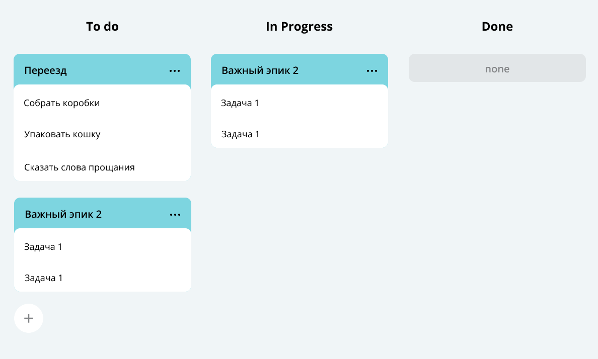

# TASK TRACKER :ledger:
### Проект:
<p>Трекер задач который позволяет эффективно организовать совместную работу над задачами</p>

---
Ведете ли список дел или может составляете список покупок, а может быть вы работаете в команде ?
<br>А чтобы ничего не забыть удобнее воспользоваться приложением.

---
### Функциональность
1. Получение списка всех задач.
2. Получение списка всех эпиков.
3. Получение списка всех подзадач определённого эпика.
4. Получение задачи любого типа по идентификатору.
5. Добавление новой задачи, эпика и подзадачи.
6. Обновление задачи любого типа по идентификатору.
7. Удаление ранее добавленных задач — всех и по идентификатору.
8. Получение списка просмотренных задач.
9. Сохранение состояний задач.
10. Формирование даты и продолжительности задачи.
11. Сортировка задач по приоритету.
12. Доступ к менеджеру через HTTP-запросы.

---
### Модель данных


---
### Стек технологий
+ [Java](https://www.java.com/)
+ [JUnit](https://junit.org/)
+ [Gson Library](https://github.com/google/gson)
+ [IntelliJ IDEA](https://www.jetbrains.com/ru-ru/idea/)
---
### Запуск приложения
Потребуется Java 11, IntelliJ IDEA

1. Склонировать
```shell
git clone https://github.com/kal-an/java-sprint2-hw
```
2. Скомпилировать проект c IntelliJ IDEA
3. Запустить используя IntelliJ IDEA